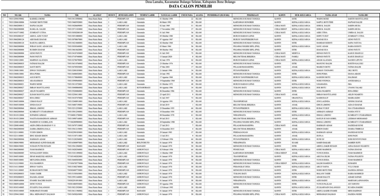

# Mencetak Data Calon Pemilih

**Mencetak Data Calon Pemilih**

* Langkah pertama, pilih menu **Kependudukan**, klik menu **Rumah Tangga**, kemudian cari dan klik tombol **Cetak** yang berada disebelah kanan.

* Langkah kedua, maka akan tampil halaman cetak data calon pemilih sesuai tanggal yang telah ditentukan. Kemudian tekan tombol **CTRL+P** pada keyboard anda untuk mencetak data calon pemilih.

