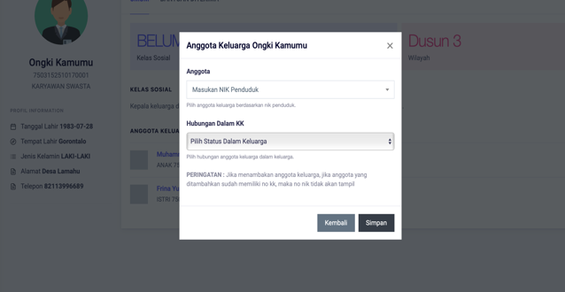

# Menambahkan Anggota Keluarga

**Menambahkan Anggota Keluarga**

* Langkah pertama, pilih menu **Kependudukan,** klik menu **Keluarga**, kemudian pilih dan klik nama **Kepala Keluarga** yang akan ditambahkan anggotanya

* Langkah kedua, setelah memilih kepala keluarga, maka halaman detail kepala keluarga akan tampil. Kemudian tekan tombol **Tambah Anggota.**

* Langkah ketiga, maka akan tampil dialog untuk menambahkan anggota keluarga. Kemudian cari nik anggota keluarga yang akan ditambahkan. Jika nik tidak ditemukan perikasa jika anggota sudah ditambahkan pada menu penduduk. Jika juga data sudah diinputkan dan data anggota tidak ditemukan, buka halaman **Penduduk,** pada menu **Kependuduk** kemudian pilih menu **Hapus Status Keluarga.** Setelah anggota di pilih tekan tombol **SIMPAN** untuk menambahkan anggota.

