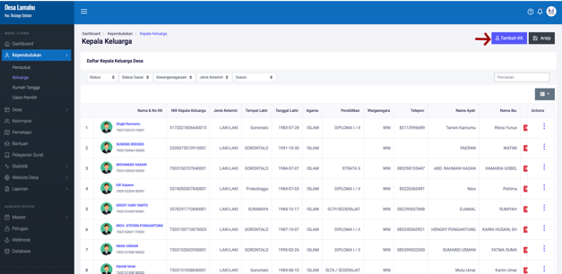
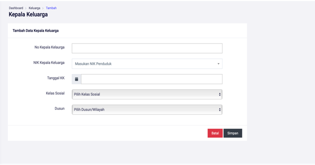

# Menambahkan Kepala Keluarga

**Menambahkan Kepala Keluarga**

* Langkah pertama, pilih menu **Kependudukan** klik menu **Keluarga**, dan tekan tombol **TAMBAH KK.**

* Langkah kedua, isi data kepala keluarga pada form yang telah disediakan, kemudian klik/tekan tombol **SIMPAN.**

