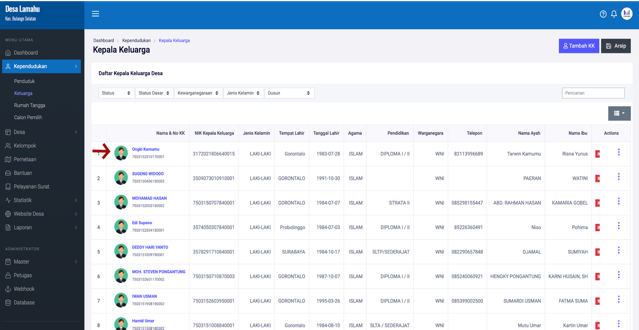
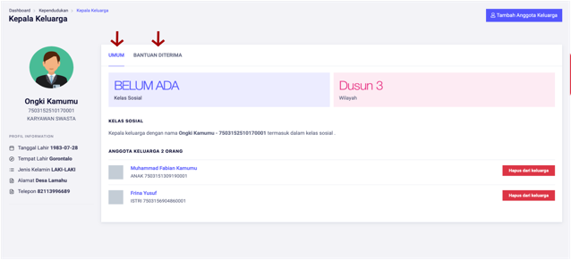

# Menampilkan Detail Kepala Keluarga

**Menampilkan Detail Kepala Keluarga**

* Langkah pertama, pilih menu **Kependudukan,** klik menu **Keluarga**, kemudian pilih dan klik nama **Kepala Keluarga** yang akan ditampilkan**.**

* Langkah kedua, setelah memilih kepala keluarga, maka akan tampil halaman **Detail Kepala Keluarga**. Pada halaman kepala keluarga terdapat detail keluarga, dan data bantuan yang pernah diterima oleh kepala keluarga.

