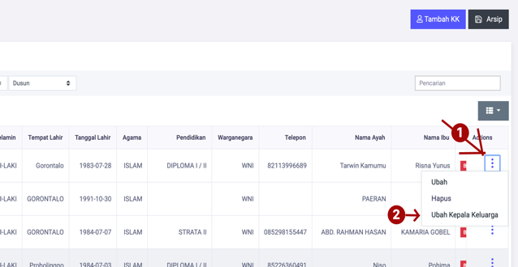

# Mengganti Kepala Keluarga

**Mengganti Kepala Keluarga**

* Langkah pertama, pilih menu **Kependudukan** klik menu **Keluarga**, dan cari tombol **Titik Tiga** dan pilih menu **Ubah Kepala Keluarga.**

* Langkah kedua, maka akan tampil dialog pengubahan kepala keluarga, dan pilih pengganti kepala keluarga yang ingin diganti. Setelah itu tekan tombol **SIMPAN.**

