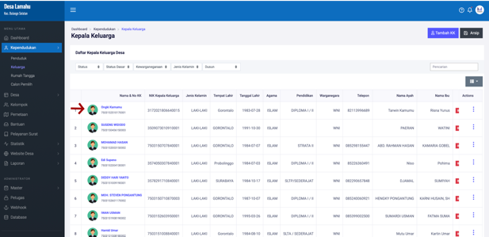
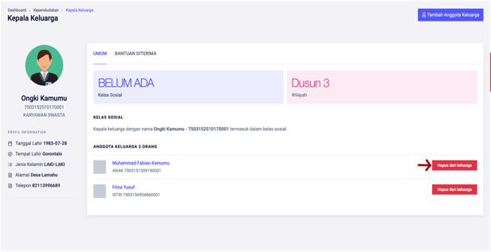

# Menghapus Anggota Keluarga

**Menghapus Anggota Keluarga**

* Langkah pertama, pilih menu **Kependudukan,** klik menu **Keluarga**, kemudian pilih dan klik nama **Kepala Keluarga** yang akan dihapus anggotanya**.**

* Langkah kedua, setelah memilih kepala keluarga, maka halaman detail kepala keluarga akan tampil. Kemudian tekan tombol **Hapus Anggota.**

* Langkah ketiga, maka akan tampil dialog konfirmasi jika anda ingin menghapus data anggota keluarga. Kemudian tekan tombol **Hapus.**

