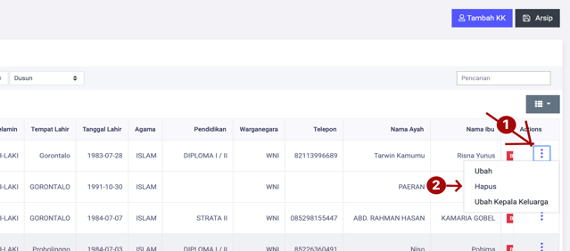
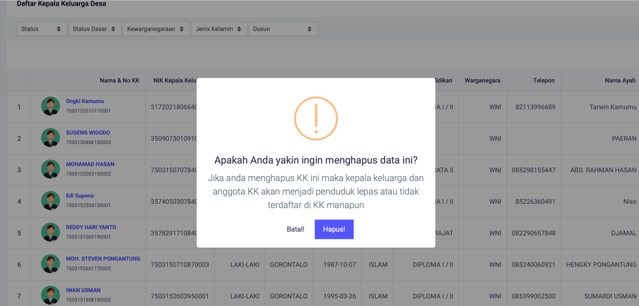

# Menghapus Data Kepala Keluarga

**Menghapus Data Kepala Keluarga**

* Langkah pertama, pilih menu **Kependudukan** klik menu **Keluarga**, dan cari tombol **Titik Tiga** dan pilih menu **Hapus.**

* Langkah kedua, akan tampil dialog konfirmasi menghapus data kepala keluarga, kemudian tekan tombol **Hapus,** untuk menghapus data kepala keluarga.

