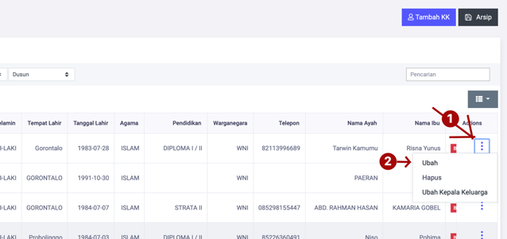
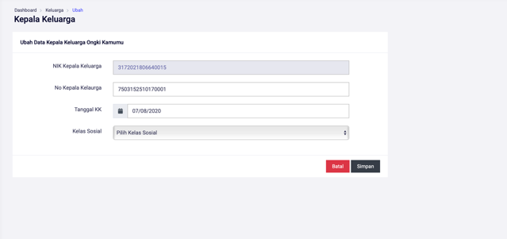

# Mengubah Data Kepala Keluarga

**Mengubah Data Kepala Keluarga**

* Langkah pertama, pilih menu **Kependudukan** klik menu **Keluarga**, dan cari tombol **Titik Tiga** dan pilih menu **Ubah.**

* Langkah kedua, selanjutnya masukan data kepala keluarga yang ingin diubah, pada form yang telah disediakan, kemudian tekan tombol **Simpan,** untuk menyimpan data kepala yang telah diubah.

