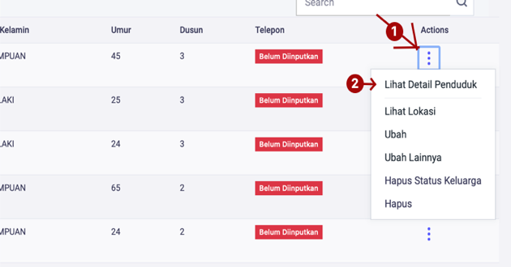
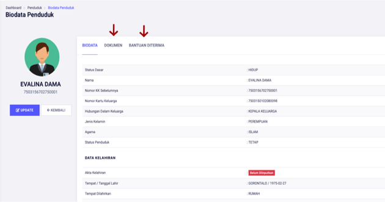

# Melihat Detail Penduduk Per Orang

**Melihat Detail Penduduk Per Orang**

* Langkah pertama, pilih halaman **Kependudukan,** selanjutnya klik menu **Penduduk**, kemudian klik tombol **Titik Tiga** pada sebelah kanan, kemudian pilih menu **Lihat Detail Penduduk.**

* Langkah kedua, setelah memilih menu **Lihat Detail Penduduk** maka akan tampil halaman detail penduduk. Pada halaman **Detail Penduduk** terdapat **Biodata Penduduk, Dokumen Penduduk, Bantuan Diterima.**

