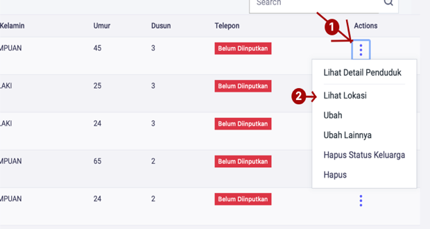

# Melihat Lokasi Penduduk

**Melihat Lokasi Penduduk**

Untuk melihat lokasi penduduk pilih halaman **Kependudukan,** selanjutnya klik menu **Penduduk**, kemudian klik tombol **Titik Tiga** pada sebelah kanan, kemudian pilih menu **Lihat Lokasi.** Maka anda akan dialihkan ke halaman yang menampilkan lokasi penduduk. Jika belum menginpukan lokasi penduduk, anda akan dialihkan kehalaman pengisian data lokasi penduduk.

