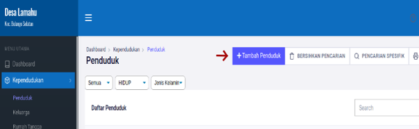
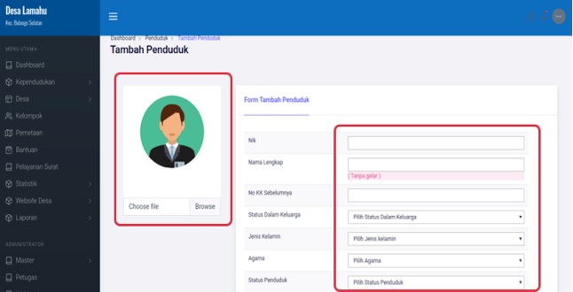
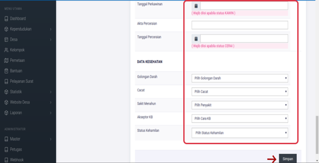

# Menambah Data Penduduk Baru

**Menambah Data Penduduk Baru**

* Langkah pertama klik tombol **Tambah Penduduk,** pada menu **Kependudukan &gt; Penduduk** kemudian akan tampil halaman pengisian data penduduk.

* Langkah kedua masukkan data penduduk pada form yang telah disediakan dan juga pilih atau upload foto penduduk yang ingin didaftarkan ke aplikasi. Setelah semua data penduduk terisi, tekan tompol **SAVE/SIMPAN.**

\*\*\*\*

