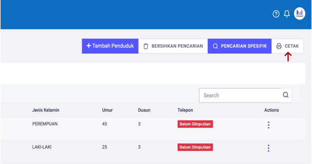
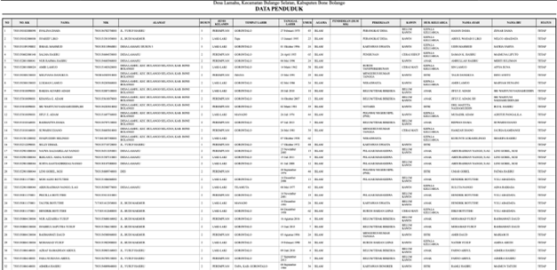

# Mencetak Daftar Data Penduduk

**Mencetak Daftar Data Penduduk**

* Langkah pertama, pilih halaman **Kependudukan,** selanjutnya klik menu **Penduduk**, kemudian klik tombol **CETAK.**

* Langkah kedua, setelah memilih tombol **CETAK** maka akan tampil halaman Daftar/List Penduduk. Kemudia tekan tombol **CTRL+P** pada keyboard.

