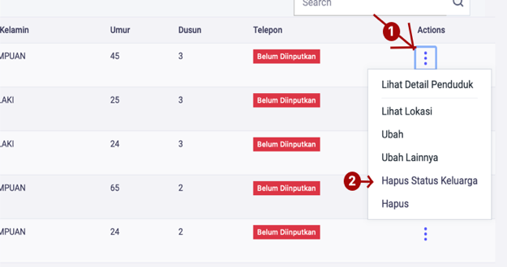
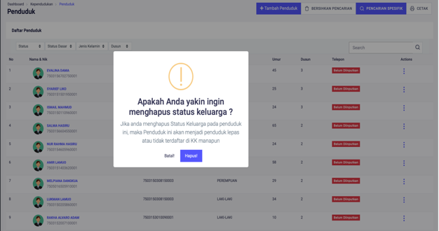

# Menghapus Status Keluarga

**Menghapus Status Keluarga**

Menu **Menghapus Status Keluarga** berfungsi jika anda ingin menambahkan penduduk kedalam anggota **KK** atau menjadi **Kepala Keluarga** dan pada form pemilihan data penduduk tidak tampil, maka anda dapat menghapus atau mengosongkan Status Keluarga yang ingin ditambahkan. Berikut ini cara menghapus data **Status Keluarga.**

Setelah memilih menu **Hapus Status Keluarga,** maka akan tampil halaman dialog konfirmasi penghapusan **Status Keluarga**

