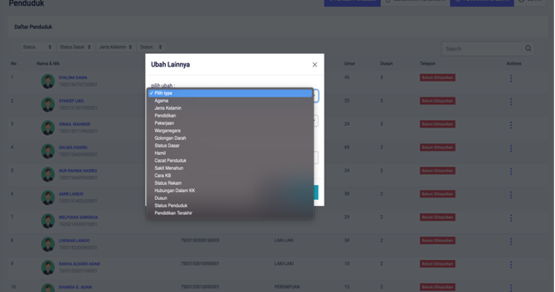

# Mengubah Data Penduduk Lainnya

**Mengubah Data Penduduk Lainnya**

Pada menu ini anda dapat mengubah mulai dari data jenis kelamin penduduk, dusun, status dasar, kewarganegaraan dan lain-lain, berikut cara melakukan pengubahan data lainya penduduk.

* Langkah pertama, pilih halaman **Kependudukan,** selanjutnya klik menu **Penduduk**, kemudian klik tombol **Titik Tiga** pada sebelah kanan, kemudian pilih menu **Ubah Lainya.**

* Langkah kedua, setalah memilih menu lainnya maka akan tampil dialog pengubahan data penduduk. Kemudian anda dapat memilih ingin mengubah data apa yang ingin diubah pada form yang telah disediakan, kemudian klik tombol **SIMPAN** untuk menyimpan data.

