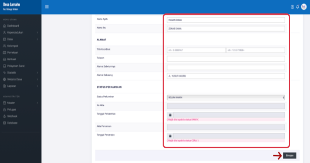

# Mengubah/Mengedit Data Penduduk

**Mengubah/Mengedit Data Penduduk**

* Langkah pertama pilih halaman **Kependudukan,** selanjutnya klik menu **Penduduk**, kemudian klik tombol **Titik Tiga** pada sebelah kanan, kemudian pilih menu **Ubah.**

* Langkah kedua, setelah memilih menu ubah maka akan tampil halaman pengubahan/pengeditan data penduduk**.** Selanjutnya ubalah data penduduk pada form yang telah disediakan.

* Langkah ketiga atau terakhir, klik tombol **SIMPAN** untuk menyimpan berubahan data yang telah dilakukan.

