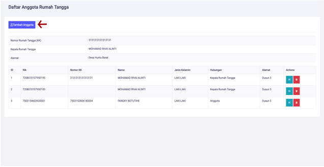

# Menambahkan Anggota Rumah Tangga

**Menambahkan Anggota Rumah Tangga**

* Langkah pertama, pilih menu **Kependudukan**, klik menu **Rumah Tangga**, kemudian pilih kepala rumah tangga yang ingin dilihat, dan cari dan klik tombol berwarna ungu di sebelah kanan.

* Langkah kedua, setelah itu akan tampil halaman detail kepala rumah tangga. Pada halaman ini terdapat menu untuk menambahkan anggota keluarga, kemudian menu **Tambah Anggota** di klik.

* Langkah ketiga, maka akan tampil dialog untuk memilih anggota rumah tangga, kemudian pilih data penduduk yang ingin ditambahkan sebagai anggota rumah tangga, jika tidak ditemukan. Anda harus memeriksa jika penduduk sudah diinputkan atau belum, jika belum anda harus menginputkan data penduduk tersebut terlebih dahulu. Setelah proses pemilihan telah selesai anda harus menekan tombol **Simpan** untuk menyimpan data.

