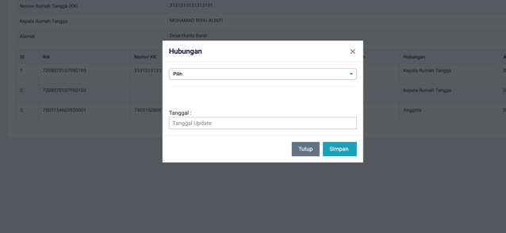

# Menggati Status Anggota Rumah Tangga

**Menggati Status Anggota Rumah Tangga**

* Langkah pertama, pilih menu **Kependudukan**, klik menu **Rumah Tangga**, kemudian pilih kepala rumah tangga yang ingin dilihat, dan cari dan klik tombol berwarna ungu di sebelah kanan.
* Langkah kedua, setelah itu akan tampil halaman detail kepala rumah tangga. Pada halaman ini terdapat tombol untuk mengganti status anggota rumah tangga, kemudian pilih status anggota rumah tangga yang baru, dan cari tombol berwarna hijau untuk mengganti status anggota, dan di klik.

* Langkah ketiga, maka akan tampil dialog untuk mengganti status anggota rumah tangga. Terdapat dua pilihan yaitu status Kepala Rumah Tangga, dan status Anggota. Anda harus memilih antara kedua pilihan tersebut. Jika telah selesai, anda haru menekan tombol **Simpan**, untuk melakukan perubahan data.

