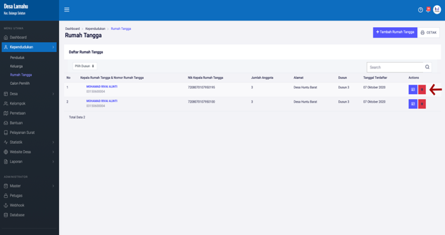
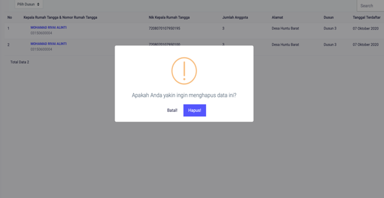

# Menghapus Rumah Tangga

**Menghapus Rumah Tangga**

* Langkah pertama, pilih menu **Kependudukan**, klik menu **Rumah Tangga**, kemudian pilih kepala rumah tangga yang ingin dihapus, dan cari dan klik tombol berwarna merah di sebelah kanan.

* Langkah kedua, selanjutnya akan tampil dialog konfirmasi untuk menghapus data kepala keluarga. Jika anda menghapus data kepala keluarga, maka anggota nya juga akan terhapus. Dengan demikian data rumah tangga yang dihapus tersebut tidak akan tampil lagi pada halaman rumah tangga. Anda harus menginputkannya/atau menambahkan lagi data kepala rumah tangga dan anggota nya.

