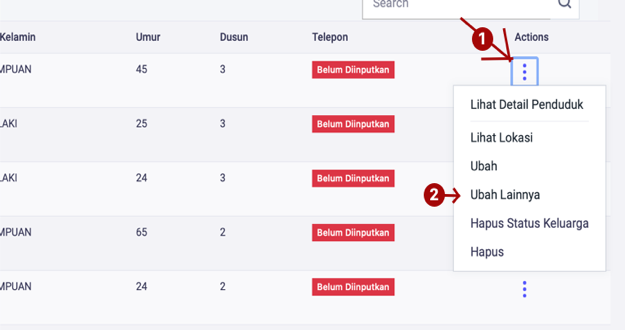
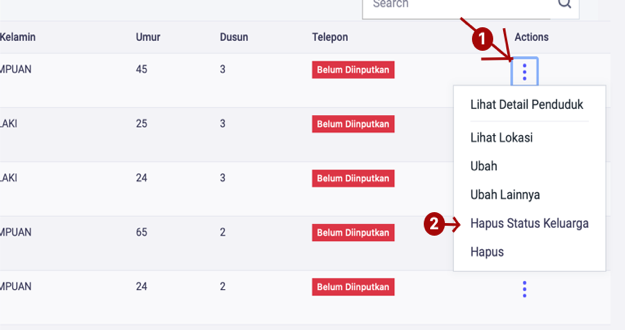
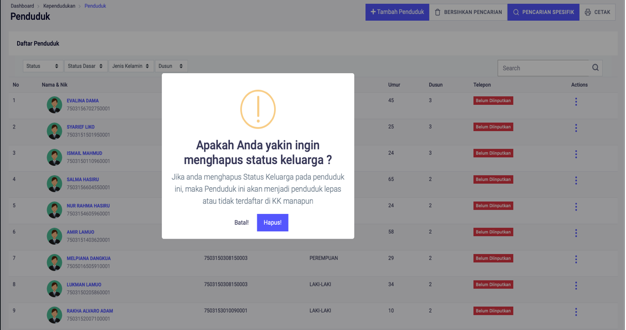
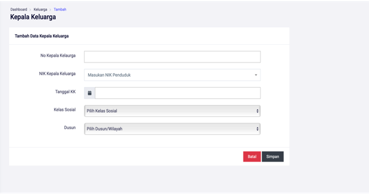
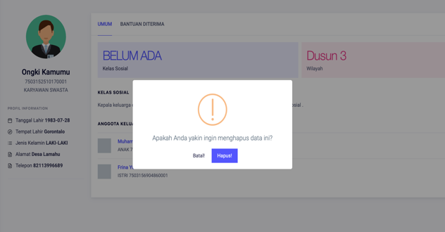
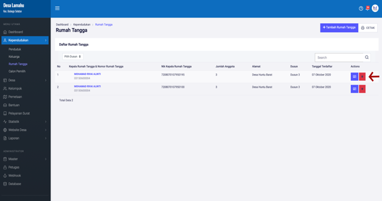
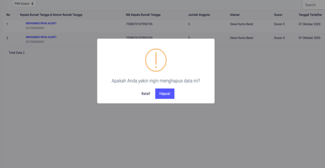

# Menu Penduduk

**Menu Penduduk**

Menu penduduk berisi daftar data penduduk yang sudah diinputkan, pada saat awal anda menekan / mengkik menu penduduk. Pada halaman ini anda dapat melakukan perubahan data penduduk, penghapusan data penduduk, pengeditan data penduduk serta anda juga dapat mengeluarkan penduduk dari daftar KK yang terkait.

* * 1. **Menambah Data Penduduk Baru**
* Langkah pertama klik tombol **Tambah Penduduk,** pada menu **Kependudukan &gt; Penduduk** kemudian akan tampil halaman pengisian data penduduk.

Gambar 3.2 Tombol **Tambah Penduduk**

* Langkah kedua masukkan data penduduk pada form yang telah disediakan dan juga pilih atau upload foto penduduk yang ingin didaftarkan ke aplikasi. Setelah semua data penduduk terisi, tekan tompol **SAVE/SIMPAN.**

Gambar 3.3 Halaman **Tambah Penduduk**

Gambar 3.4 Tombol Menyimpan Data Penduduk

* * 1. **Mengubah/Mengedit Data Penduduk**
* Langkah pertama pilih halaman **Kependudukan,** selanjutnya klik menu **Penduduk**, kemudian klik tombol **Titik Tiga** pada sebelah kanan, kemudian pilih menu **Ubah.**

Gambar 3.4 Menu Mengubah Data Penduduk

* Langkah kedua, setelah memilih menu ubah maka akan tampil halaman pengubahan/pengeditan data penduduk**.** Selanjutnya ubalah data penduduk pada form yang telah disediakan.

Gambar 3.5 Halaman Mengubah Data Penduduk

* Langkah ketiga atau terakhir, klik tombol **SIMPAN** untuk menyimpan berubahan data yang telah dilakukan.

Gambar 3.6 Tombol Menyimpan Data Penduduk

* * 1. **Mengubah Data Penduduk Lainnya**

Pada menu ini anda dapat mengubah mulai dari data jenis kelamin penduduk, dusun, status dasar, kewarganegaraan dan lain-lain, berikut cara melakukan pengubahan data lainya penduduk.

* Langkah pertama, pilih halaman **Kependudukan,** selanjutnya klik menu **Penduduk**, kemudian klik tombol **Titik Tiga** pada sebelah kanan, kemudian pilih menu **Ubah Lainya.**

Gambar 3.7 Tombol Ubah Lainnya

* Langkah kedua, setalah memilih menu lainnya maka akan tampil dialog pengubahan data penduduk. Kemudian anda dapat memilih ingin mengubah data apa yang ingin diubah pada form yang telah disediakan, kemudian klik tombol **SIMPAN** untuk menyimpan data.

Gambar 3.8 Dialog Ubah Lainnya

* * 1. **Melihat Lokasi Penduduk**

Untuk melihat lokasi penduduk pilih halaman **Kependudukan,** selanjutnya klik menu **Penduduk**, kemudian klik tombol **Titik Tiga** pada sebelah kanan, kemudian pilih menu **Lihat Lokasi.** Maka anda akan dialihkan ke halaman yang menampilkan lokasi penduduk. Jika belum menginpukan lokasi penduduk, anda akan dialihkan kehalaman pengisian data lokasi penduduk.

Gambar 3.9 Menu Lihat Lokasi Penduduk

* * 1. **Melihat Detail Penduduk Per Orang**
* Langkah pertama, pilih halaman **Kependudukan,** selanjutnya klik menu **Penduduk**, kemudian klik tombol **Titik Tiga** pada sebelah kanan, kemudian pilih menu **Lihat Detail Penduduk.**

Gambar 3.10 Menu Lihat Detail Penduduk

* Langkah kedua, setelah memilih menu **Lihat Detail Penduduk** maka akan tampil halaman detail penduduk. Pada halaman **Detail Penduduk** terdapat **Biodata Penduduk, Dokumen Penduduk, Bantuan Diterima.**

Gambar 3.11 Halaman Lihat Detail Penduduk

* * 1. **Mencetak Detail Penduduk**
* Langkah pertama, pilih/klik tombol **CETAK** pada halaman detail penduduk.

Gambar 3.12 Cetak Detail Penduduk

* Langkah kedua, setelah mengklik tombol cetak maka akan tampil halaman **Cetak Detail Penduduk.**

Gambar 3.13 Halaman Cetak Detail Penduduk

* * 1. **Menghapus Status Keluarga**

Menu **Menghapus Status Keluarga** berfungsi jika anda ingin menambahkan penduduk kedalam anggota **KK** atau menjadi **Kepala Keluarga** dan pada form pemilihan data penduduk tidak tampil, maka anda dapat menghapus atau mengosongkan Status Keluarga yang ingin ditambahkan. Berikut ini cara menghapus data **Status Keluarga.**

Gambar 3.14 Menu Hapus Status Keluarga

Setelah memilih menu **Hapus Status Keluarga,** maka akan tampil halaman dialog konfirmasi penghapusan **Status Keluarga**

Gambar 3.15 Dialog Konfirmasi Hapus Status Keluarga

* * 1. **Menghapus Data Penduduk**
* Langkah pertama, pilih halaman **Kependudukan,** selanjutnya klik menu **Penduduk**, kemudian klik tombol **Titik Tiga** pada sebelah kanan, kemudian pilih menu **Hapus.**

Gambar 3.16 Menu Hapus Penduduk

* Langkah kedua, setelah memilih menu **Hapus** maka akan tampil Dialog Konfirmasi penghapusan data penduduk.

Gambar 3.17 Dialog Konfirmasi Hapus Penduduk

* * 1. **Mencetak Daftar Data Penduduk**
* Langkah pertama, pilih halaman **Kependudukan,** selanjutnya klik menu **Penduduk**, kemudian klik tombol **CETAK.**

Gambar 3.18 Tombol Cetak Penduduk

* Langkah kedua, setelah memilih tombol **CETAK** maka akan tampil halaman Daftar/List Penduduk. Kemudia tekan tombol **CTRL+P** pada keyboard.

Gambar 3.19 Halaman Cetak Semua Penduduk

1. **Menu Keluarga**

Menu keluarga berisi daftar data keluarga yang sudah diinputkan, pada saat awal anda menekan / mengkik menu keluarga. Pada halaman ini anda dapat melakukan perubahan data, penghapusan data, pengeditan data serta anda juga dapat menambahkan anggota keluarga.

Gambar 3.20 Halaman Kepala Keluarga

* * 1.  **Menambahkan Kepala Keluarga**
* Langkah pertama, pilih menu **Kependudukan** klik menu **Keluarga**, dan tekan tombol **TAMBAH KK.**

Gambar 3.21 Tombol Tambah Kepala Keluarga

* Langkah kedua, isi data kepala keluarga pada form yang telah disediakan, kemudian klik/tekan tombol **SIMPAN.**

Gambar 3.22 Halaman Tambah Kepala Keluarga

* * 1.  **Menampilkan Detail Kepala Keluarga**
* Langkah pertama, pilih menu **Kependudukan,** klik menu **Keluarga**, kemudian pilih dan klik nama **Kepala Keluarga** yang akan ditampilkan**.**

Gambar 3.23 Tombol Detail Kepala Keluarga

* Langkah kedua, setelah memilih kepala keluarga, maka akan tampil halaman **Detail Kepala Keluarga**. Pada halaman kepala keluarga terdapat detail keluarga, dan data bantuan yang pernah diterima oleh kepala keluarga.

Gambar 3.24 Halaman Detail Kepala Keluarga

* * 1.  **Mengubah Data Kepala Keluarga**
* Langkah pertama, pilih menu **Kependudukan** klik menu **Keluarga**, dan cari tombol **Titik Tiga** dan pilih menu **Ubah.**

Gambar 3.25 Tombol Ubah Kepala Keluarga

* Langkah kedua, selanjutnya masukan data kepala keluarga yang ingin diubah, pada form yang telah disediakan, kemudian tekan tombol **Simpan,** untuk menyimpan data kepala yang telah diubah.

Gambar 3.26 Halaman Ubah Kepala Keluarga

* * 1.  **Menghapus Data Kepala Keluarga**
* Langkah pertama, pilih menu **Kependudukan** klik menu **Keluarga**, dan cari tombol **Titik Tiga** dan pilih menu **Hapus.**

Gambar 3.27 Tombol Hapus Kepala Keluarga

* Langkah kedua, akan tampil dialog konfirmasi menghapus data kepala keluarga, kemudian tekan tombol **Hapus,** untuk menghapus data kepala keluarga.

Gambar 3.28 Dialog Hapus Kepala Keluarga

* * 1.  **Mengganti Kepala Keluarga**
* Langkah pertama, pilih menu **Kependudukan** klik menu **Keluarga**, dan cari tombol **Titik Tiga** dan pilih menu **Ubah Kepala Keluarga.**

Gambar 3.29 Menu Mengganti Kepala Keluarga

* Langkah kedua, maka akan tampil dialog pengubahan kepala keluarga, dan pilih pengganti kepala keluarga yang ingin diganti. Setelah itu tekan tombol **SIMPAN.**

Gambar 3.30 Dialog Mengganti Kepala Keluarga

* * 1.  **Mencetak Data Kepala Keluarga**
* Langkah pertama, pilih menu **Kependudukan** klik menu **Keluarga**, dan cari tombol **Arsip.**

Gambar 3.31 Tombol Arsip Kepala Keluarga

* Langkah kedua, maka akan tampil halaman Arsip Data Kepala Keluarga, kemudian untuk mencetak tekan tombol **CTRL+P**.

Gambar 3.32 Halaman Arsip Kepala Keluarga

* * 1.  **Mencari/Memfilter Data Kepala Keluarga**

Pada menu keluarga anda dapat melakukan proses pencarian dan memfilter data penduduk yang ingin ditampilkan, dengan cara menggunakan menu yang telah disediakan, seperti pada gambar dibawah ini.

Gambar 3.33 Halaman Filter Kepala Keluarga

* * 1.  **Menambahkan Anggota Keluarga**
* Langkah pertama, pilih menu **Kependudukan,** klik menu **Keluarga**, kemudian pilih dan klik nama **Kepala Keluarga** yang akan ditambahkan anggotanya

**.**

Gambar 3.34 Tombol Detail Kepala Keluarga

* Langkah kedua, setelah memilih kepala keluarga, maka halaman detail kepala keluarga akan tampil. Kemudian tekan tombol **Tambah Anggota.**

Gambar 3.35 Tambah Anggota Kepala Keluarga

* Langkah ketiga, maka akan tampil dialog untuk menambahkan anggota keluarga. Kemudian cari nik anggota keluarga yang akan ditambahkan. Jika nik tidak ditemukan perikasa jika anggota sudah ditambahkan pada menu penduduk. Jika juga data sudah diinputkan dan data anggota tidak ditemukan, buka halaman **Penduduk,** pada menu **Kependuduk** kemudian pilih menu **Hapus Status Keluarga.** Setelah anggota di pilih tekan tombol **SIMPAN** untuk menambahkan anggota.

Gambar 3.36 Dialog Anggota Kepala Keluarga

* * 1.  **Menghapus Anggota Keluarga**
* Langkah pertama, pilih menu **Kependudukan,** klik menu **Keluarga**, kemudian pilih dan klik nama **Kepala Keluarga** yang akan dihapus anggotanya**.**

Gambar 3.37 Tombol Detail Kepala Keluarga

* Langkah kedua, setelah memilih kepala keluarga, maka halaman detail kepala keluarga akan tampil. Kemudian tekan tombol **Hapus Anggota.**

Gambar 3.38 Hapus Anggota Kepala Keluarga

* Langkah ketiga, maka akan tampil dialog konfirmasi jika anda ingin menghapus data anggota keluarga. Kemudian tekan tombol **Hapus.**

Gambar 3.39 Dialog Anggota Kepala Keluarga

1. **Menu Rumah Tangga**

Menu rumah tangga berisi daftar data rumah tangga yang sudah diinputkan, pada saat awal anda menekan / mengkik menu rumah tangga. Pada halaman ini anda dapat melakukan perubahan data rumah tangga, penghapusan data rumah tangga, pengeditan data rumah tangga serta anda juga dapat mengeluarkan, dan menambahkan anggota rumah tangga dari daftar kepala rumah tangga.

Gambar 3.40 Halaman Rumah Tangga

* * 1.  **Menambah Kepala Rumah Tangga**
* Langkah pertama, pilih menu **Kependudukan**, klik menu **Rumah Tangga**, kemudian cari dan klik tombol **Tambah Rumah Tangga**.

Gambar 3.41 Tombol Tambah Rumah Tangga

* Langkah kedua, maka akan tampil dialog menambahkan data rumah tangga baru, kemudian pilih penduduk yang ingin dijadikan kepala rumah tangga, dan tekan tombol **Simpan**, jika ingin menyimpan data rumah tangga baru.

Gambar 3.42 Dialog Tambah Rumah Tangga

* * 1.  **Memfilter Data Rumah Tangga**

Pada menu rumah tangga anda dapat melakukan proses pencarian dan memfilter data kepala rumah tangga yang ingin ditampilkan, dengan cara menggunakan menu yang telah disediakan, seperti pada gambar dibawah ini.

Gambar 3.43 Filter Data Rumah Tangga

* * 1.  **Menampilkan Detail Kepala Rumah Tangga**
* Langkah pertama, pilih menu **Kependudukan**, klik menu **Rumah Tangga**, kemudian pilih kepala rumah tangga yang ingin dilihat, dan cari dan klik tombol berwarna ungu di sebelah kanan.

Gambar 3.44 Tombol Detail Rumah Tangga

* Langkah kedua, setelah itu akan tampil halaman detail kepala rumah tangga. Pada halaman ini terdapat beberapa infomasi dan menu, seperti menambahkan anggota keluarga, mengganti status anggota, menghapus anggota, dan menampilkan data anggota rumah tangga.

Gambar 3.45 Halaman Detail Rumah Tangga

* * 1.  **Menghapus Rumah Tangga**
* Langkah pertama, pilih menu **Kependudukan**, klik menu **Rumah Tangga**, kemudian pilih kepala rumah tangga yang ingin dihapus, dan cari dan klik tombol berwarna merah di sebelah kanan.

Gambar 3.46 Tombol Hapus Rumah Tangga

* Langkah kedua, selanjutnya akan tampil dialog konfirmasi untuk menghapus data kepala keluarga. Jika anda menghapus data kepala keluarga, maka anggota nya juga akan terhapus. Dengan demikian data rumah tangga yang dihapus tersebut tidak akan tampil lagi pada halaman rumah tangga. Anda harus menginputkannya/atau menambahkan lagi data kepala rumah tangga dan anggota nya.

Gambar 3.47 Dialog Hapus Rumah Tangga

* * 1.  **Mencetak Data Rumah Tangga**
* Langkah pertama, pilih menu **Kependudukan**, klik menu **Rumah Tangga**, kemudian cari dan klik tombol **CETAK** di sebelah kanan.

Gambar 3.48 Tombol Cetak Rumah Tangga

* Langkah kedua, selanjutnya akan tampil halaman cetak data kepala rumah tangga. Kemudian tekan tombol **CTRL+P** pada keyboard anda untuk mencetak data.

Gambar 3.49 Halaman Cetak Rumah Tangga

* * 1.  **Menambahkan Anggota Rumah Tangga**
* Langkah pertama, pilih menu **Kependudukan**, klik menu **Rumah Tangga**, kemudian pilih kepala rumah tangga yang ingin dilihat, dan cari dan klik tombol berwarna ungu di sebelah kanan.

Gambar 3.50 Tombol Detail Rumah Tangga

* Langkah kedua, setelah itu akan tampil halaman detail kepala rumah tangga. Pada halaman ini terdapat menu untuk menambahkan anggota keluarga, kemudian menu **Tambah Anggota** di klik.

Gambar 3.51 Tombol Tambah Rumah Tangga

* Langkah ketiga, maka akan tampil dialog untuk memilih anggota rumah tangga, kemudian pilih data penduduk yang ingin ditambahkan sebagai anggota rumah tangga, jika tidak ditemukan. Anda harus memeriksa jika penduduk sudah diinputkan atau belum, jika belum anda harus menginputkan data penduduk tersebut terlebih dahulu. Setelah proses pemilihan telah selesai anda harus menekan tombol **Simpan** untuk menyimpan data.

Gambar 3.52 Dialog Tambah Rumah Tangga

* * 1.  **Menghapus Anggota Rumah Tangga**
* Langkah pertama, pilih menu **Kependudukan**, klik menu **Rumah Tangga**, kemudian pilih kepala rumah tangga yang ingin dilihat, dan cari dan klik tombol berwarna ungu di sebelah kanan. Seperti pada **Gambar 3.50**
* Langkah kedua, setelah itu akan tampil halaman detail kepala rumah tangga. Pada halaman ini terdapat tombol untuk menghapus anggota keluarga, kemudian pilih anggota yang ingin dihapus, dan cari tombol berwarna merah untuk menghapus anggota, dan di klik.

Gambar 3.53 Hapus Anggota Rumah Tangga

* Langkah ketiga, maka akan tampil dialog pesan jika anggota berhasil di hapus atau tidak, jika yang dihapus adalah kepala rumah tangga, maka data tidak akan terhapus, anda harus menghapus anggotanya terlebih dahulu, kemdian anda bisa menghapus kepala rumah tangganya.
  * 1.  **Menggati Status Anggota Rumah Tangga**
* Langkah pertama, pilih menu **Kependudukan**, klik menu **Rumah Tangga**, kemudian pilih kepala rumah tangga yang ingin dilihat, dan cari dan klik tombol berwarna ungu di sebelah kanan. Seperti pada **Gambar 3.50**
* Langkah kedua, setelah itu akan tampil halaman detail kepala rumah tangga. Pada halaman ini terdapat tombol untuk mengganti status anggota rumah tangga, kemudian pilih status anggota rumah tangga yang baru, dan cari tombol berwarna hijau untuk mengganti status anggota, dan di klik.

Gambar 3.54 Ubah Status Anggota Rumah Tangga

* Langkah ketiga, maka akan tampil dialog untuk mengganti status anggota rumah tangga. Terdapat dua pilihan yaitu status Kepala Rumah Tangga, dan status Anggota. Anda harus memilih antara kedua pilihan tersebut. Jika telah selesai, anda haru menekan tombol **Simpan**, untuk melakukan perubahan data.

Gambar 3.55 Dialog Status Anggota Rumah Tangga

1. **Menu Calon Pemilih**

Menu calon pemilih berisi daftar data calon pemilih berdasarkan tanggal kelahiran. Pada halaman ini anda dapat melakukan pencarian data calon pemilih berdasarkan tanggal pemilihan, berdasarkan dusun, berdasarkan jenis kelamin, dan berdasarkan nama pemilih. Data yang ditampilkan bersumber dari data kependudukan yang telah diinputkan sebelumnya.

Gambar 3.56 Halaman Calon Pemilih

* * 1.  **Memfilter Data Calon Pemilih**

Untuk menampilkan data calon pemilih anda harus memilih menu **Kependudukan**, klik menu **Calon Pemilih**, kemudian pilih/rubah tanggal pemilihan yang sesuai. Selain itu anda juga dapat menentukan dusun pemilih, jenis kelamin, dan nama pemilih.

Gambar 3.57 Filter/Pencarian Calon Pemilih

* * 1.  **Mencetak Data Calon Pemilih**
* Langkah pertama, pilih menu **Kependudukan**, klik menu **Rumah Tangga**, kemudian cari dan klik tombol **Cetak** yang berada disebelah kanan.

Gambar 3.57 Tombol Cetak Calon Pemilih

* Langkah kedua, maka akan tampil halaman cetak data calon pemilih sesuai tanggal yang telah ditentukan. Kemudian tekan tombol **CTRL+P** pada keyboard anda untuk mencetak data calon pemilih.

Gambar 3.58 Halaman Cetak Calon Pemilih

