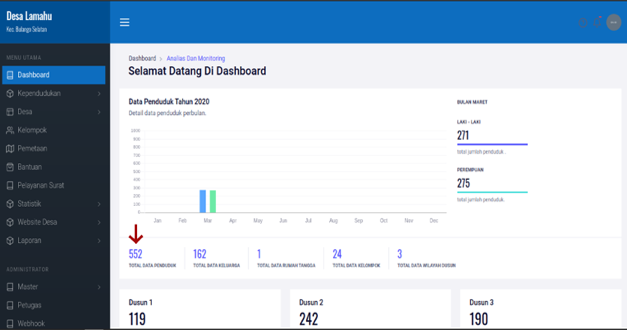
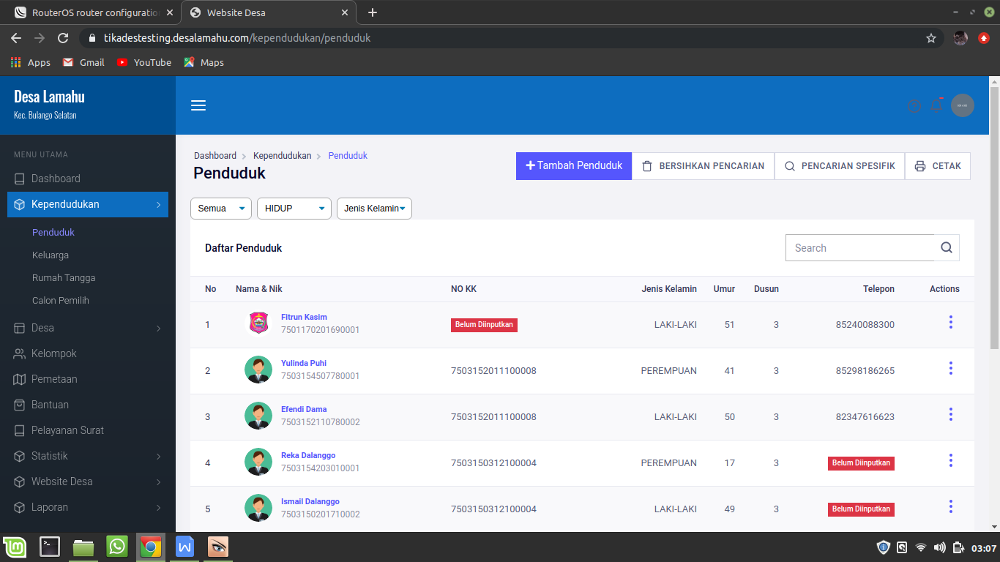

# Menu Dashboard/Menu Utama

**Menu Dashboard/Menu Utama**

Menu utama dashboard dapat diakses oleh kedua level user seperti yang dijelaskan sebelumnya. Pada halaman dashboard anda dapat melihat semua informasi mengenai data kependudukan yang ada di desa. Hingga data apa saja yang belum diinputkan oleh operator desa. Selain itu anda juga dapat melihat data secara mendetail dengan mengkilik menu atau angka yang ada pada halaman dashboard aplikasi, seperti pada gambar berikut ini.

Gambar 2.1 Halaman Dashboard

Gambar 2.2 Halaman Detail Data Dashboard

Selain itu juga pada halaman dashboard kita bisa melihat total data belum diinputkan berdasarkan data penduduk dan data keluarga, serta data penduduk dan kepala keluarga yang belum tersisi secara rinci.

Gambar 2.3 Halaman Dashboard Data Belum Diinputkan

Seperti pada bagian sebelumnya anda juga dapat melihat data penduduk yang data kependudukan nya belum lengkap/terisi dengan mengkik tombol yang ada pada dashboard.

